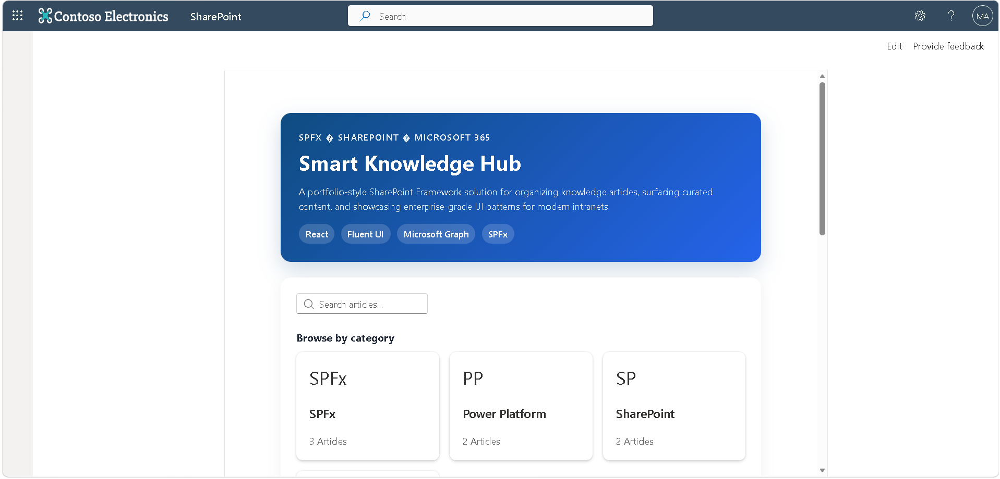
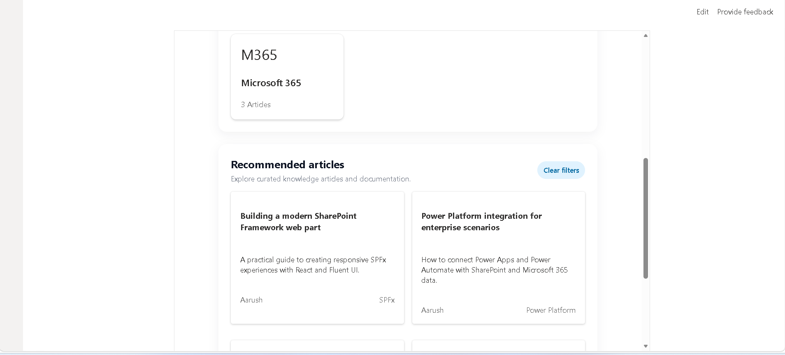

# Smart Knowledge Hub SPFx

A modern SharePoint Framework web part built as a learning and portfolio project for showcasing SPFx, React, Fluent UI, and Microsoft 365 integration concepts. This solution presents a knowledge hub experience with searchable content, categorized article cards, and a clean enterprise-style layout suitable for GitHub showcases and resume discussions.


## Screenshots






## Key features

- Responsive knowledge hub layout
- Searchable article experience
- Category-based browsing
- Reusable card-based UI components
- Clean architecture for future Microsoft Graph or SharePoint data integration

## Tech stack

- SharePoint Framework (SPFx)
- React 17
- TypeScript
- Fluent UI React
- PnPjs libraries
- Microsoft Graph-ready architecture

## Project structure

- src/components: reusable UI components such as cards and search
- src/pages/Home: main knowledge hub experience
- src/services: SharePoint and Graph service abstractions
- src/models: typed data models for articles and categories

## Prerequisites

- Node.js 22.x
- A Microsoft 365 developer tenant or SharePoint Online environment
- Basic SPFx development setup

## Getting started

1. Clone the repository
2. Install dependencies:
   ```bash
   npm install
   ```
3. Start the local workbench:
   ```bash
   npm start
   ```
4. Open the local SharePoint Workbench and add the web part to preview it

## Build

```bash
npm run build
```

## Resume-ready summary

Built an SPFx-based knowledge hub concept to demonstrate practical experience in:

- Front-end development with React and TypeScript
- SharePoint Framework web part architecture
- Modern UI implementation using Fluent UI
- Enterprise-style design thinking for intranet experiences

## GitHub publish

If you want to publish this project on GitHub, run:

```bash
git init -b main
git add .
git commit -m "Initial commit"
git remote add origin https://github.com/Ashpawarash1/smart-knowledge-hub-spfx.git
git push -u origin main
```

## License

This project is licensed under the MIT License.
